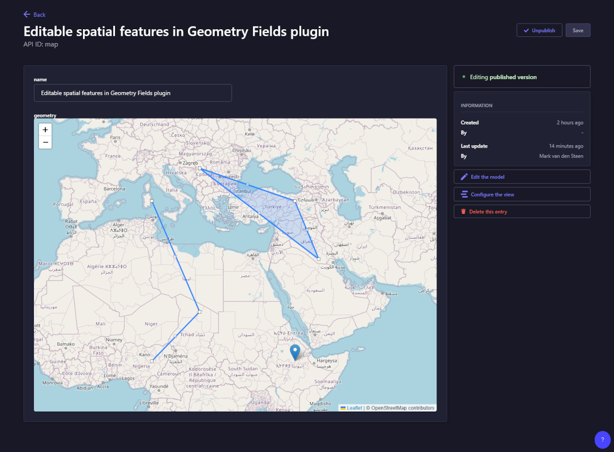

# strapi-plugin-geometry-fields

Store and edit geospatial data in a Strapi custom field.

The plugin accepts WKT (Well-known text) from the API and stores it as binary (WKB) in the geometry field. 
It needs PostgreSQL as database and PostGIS installed 
 
Example for: "GEOMETRYCOLLECTION (POINT (40 10),
LINESTRING (10 10, 20 20, 10 40),
POLYGON ((40 40, 20 45, 45 30, 40 40)))"

## Installation

<pre> # with yarn
yarn add strapi-plugin-geometry-fields </pre>

<pre> # with npm
npm install strapi-plugin-geometry-fields </pre>

## Configuration

Add the plugin to the list in plugins.js:

<pre>   'geometry-fields': {
    enabled: true,
    resolve: "strapi-plugin-geometry-fields",
  },
</pre>

This plugin runs on PostgreSQL and needs PostGIS to be installed. If you haven't already done so run this query:

<pre>CREATE EXTENSION postgis;</pre>

For the Leaflet map to display you must allow Openstreetmap in your middlewares.js like so:

<pre>
  {
    name: "strapi::security",
    config: {
      contentSecurityPolicy: {
        useDefaults: true,
        directives: {
          "img-src": ["'self'", "data:", "*.tile.openstreetmap.org"],
          upgradeInsecureRequests: null,
        },
      },
    },
  },
</pre>

## Usage

### In the Content Type Builder

- Create a new collection type
- In the field selection, choose CUSTOM, select the Geometry field and give it a name
- Finish & Save

### Manually

Add this field to the schema.json of your content type

<pre>{
  "type": "customField",
  "customField": "plugin::geometry-fields.geometry",
  "name": "location"
}</pre>

## Tested with

- Strapi 4.25.22
- PostgreSQL 12.4
- PostGIS 3.0.2

## License

MIT 

## Ideas

If you're doing some heavy spatial queries to the api, consider indexing the geometry field in Postgres 

Indexing

Instead of WKT, you can also send GeoJSON to the API with an array of features if you create a custom controller. You can do something like this: ...

Geojson as input

## Todo

- Make Strapi 5 compatible
- Create & delete features in custom field

